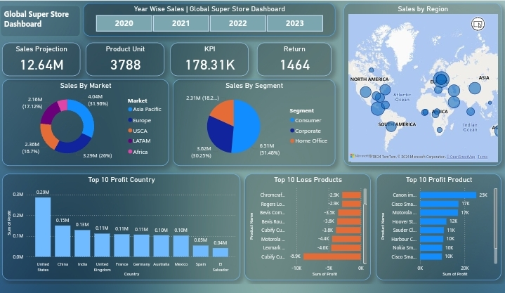

# Global-Super-Store-Dashboard
A comprehensive Power BI dashboard providing insights into global sales performance, market analysis, and product profitability for the Global Super Store. This project showcases data-driven decision-making capabilities and advanced visualization techniques.
# Global Super Store Dashboard

## Overview
I developed a comprehensive **Global Super Store Dashboard** using Power BI that provides deep insights into year-wise sales, segment-wise sales, and market performance.

### Key Features:
- **Yearly Sales Analysis (2020-2023):**
  - Sales projection: $12.64M
  - Return: 1,464
  - KPI: 178.31K
  - Product units: 3,788

- **Sales by Segment:**
  - Consumer: 51.48%
  - Corporate: 30.25%
  - Home Office: 18.27%

- **Sales by Market:**
  - Asia Pacific: $4.04M
  - Europe: $3.29M
  - USCA: $2.36M
  - LATAM: $2.16M
  - Africa: $2.16M

- **Profit by Country:** Highlighting top performers like the United States, China, and India.

- **Product Performance:**
  - **Top Performing Products:** Canon imager, Cisco Smart, Motorola.
  - **Loss-Making Products:** Lesro Training, Bevis Wood, Chromcraft.

This dashboard enables data-driven decision-making by visualizing critical metrics and trends.

## Live Dashboard
[Click here to view the live dashboard](https://t.ly/cUooH)

## Dashboard Screenshot

